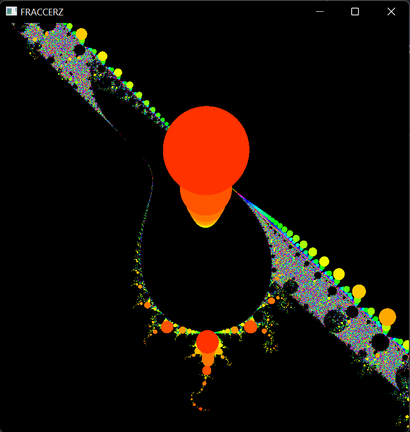
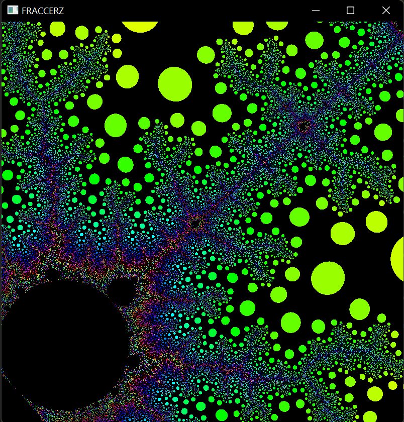

# Fraccerz

## Building
`cargo run --release`

$$ z = \frac{z^2}{(z + 0.01i)(z - 0.02i)} + c$$

$$ z = \frac{z^2}{(z + \frac{1}{\sqrt{2}i})(z - \frac{1}{\sqrt{2}}i)} + c$$

Its a fully sick fractal program

shift click to zoom in

ctrl click to zoom out

protip: if you want to move around quick make the window small

## TODO
- antialiased screenshot taker
- SIMD
- radix option might make it faster?? if the overhead of the mpmc is stupid
- storing what z got up to? maybe faster
